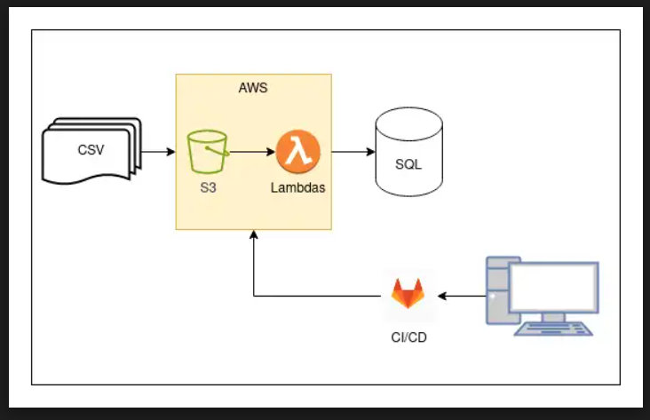

<p align="center">
  
</p>

## Intermediate Data Engineer Test

### Context
A supermarket stores its transaction data in a relational database for further analysis. The transaction data is uploaded to the system as a CSV file multiple times a day, with each transaction having a unique `id`. As a data engineer, your task is to implement and maintain a pipeline for storing this transaction data in the database.

### Provided Elements
- **SQLite Database**: Contains historical transaction data.
- **CSV File**: `retail_15_01_2022.csv` with transaction data from 15/01/2022.
- **Tax Rate**: 20% for all products.

### ETL Implementation Overview
The following steps outline the implementation of the ETL (Extract, Transform, Load) workflow:

1. **Extraction**: 
   - The `extract_data` function reads the CSV file using Pandas. It returns a DataFrame containing the extracted data or raises an error if the file is not found.

[//]: # (   ```python)

[//]: # (   def extract_data&#40;filename&#41;:)

[//]: # (       ...)

[//]: # (       return pd.read_csv&#40;filename&#41;)

[//]: # (   ```)

2. **Transformation**:
   - The `extract_date_from_filename` function uses regex to extract the date from the filename (e.g., `15_01_2022` from `retail_15_01_2022.csv`). If no date is found, it raises a `ValueError`.

   - The `transform_value_to_date` function converts the extracted date string into a proper datetime object (e.g., converting `15_01_2022` to `2022-01-15`).

   - Finally, the `rename_description_column` transform the DataFrame by adding a **transaction_date** column and renaming description to name.
and renames the **description** column to **name** for consistency with the database schema.

3. **Loading**: 
   - The `load_data` function checks if the SQLite database file exists. It then connects to the database and loads the transformed DataFrame into the **transactions** table, appending the new records. If successful, it prints the number of lines loaded.

#### Testing
- Implement test cases: See `test_etl.py`.
---
    In the ETL tests, I utilized the `unittest` framework to validate the data transformation process. The `setUpClass` method loads the CSV file into a Pandas DataFrame before running the tests, ensuring that the necessary data is available. The tests include checking the number of transactions for a specific date and verifying that the transformation function correctly adds the `transaction_date` column and renames the `description` column to `name`, ensuring the integrity of the data transformation workflow.
---

#### Data Exploration
- Explore the data using SQL: See `data_exploration.py`.
---
    In the descriptive analysis, I established a connection to the SQLite database and executed several SQL queries to gather insights about transaction data.
---

#### Deployment (Optional)
For deployment using **AWS**, a **Lambda function** with **S3 storage** is recommended for efficiency and cost-effectiveness.

- **Advantages**:
  - The program runs only when the Lambda function detects the CSV file in the S3 bucket.
  - Eliminates the need for an always-on server.
  - You only pay for storage and execution time, making the solution lightweight and scalable.

<p align="center">
  
</p>
